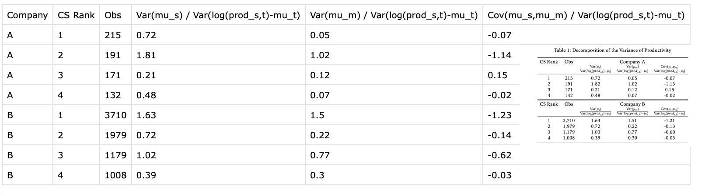
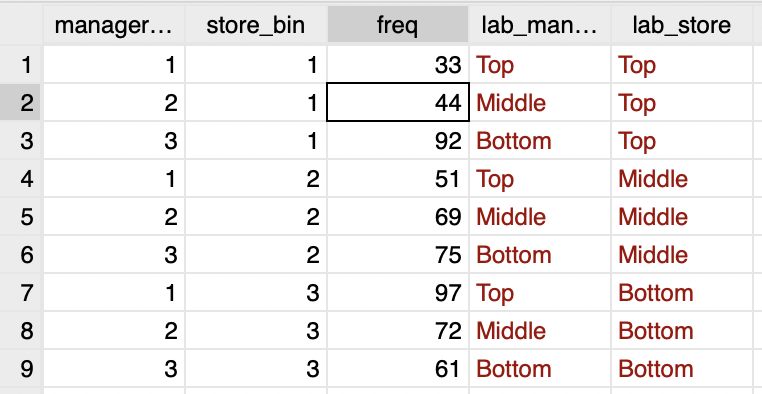
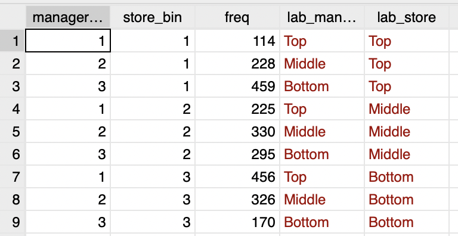
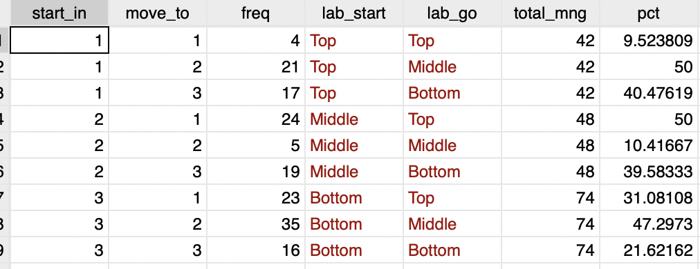
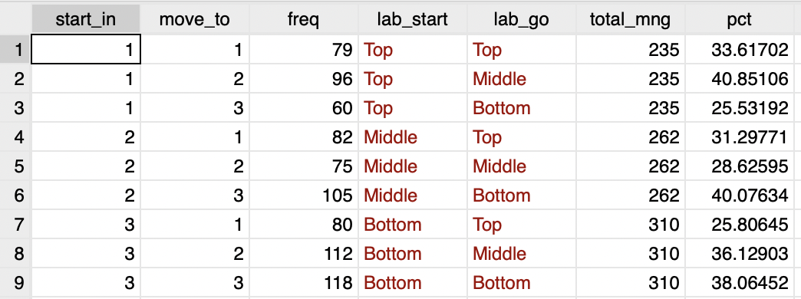
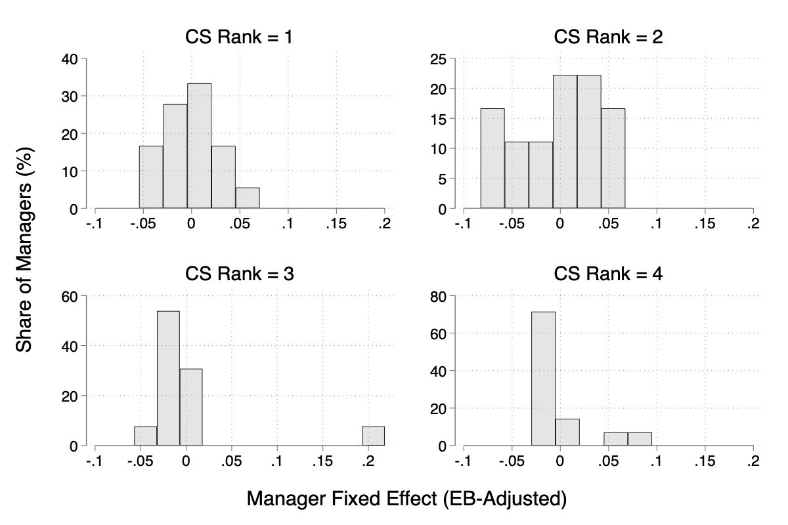
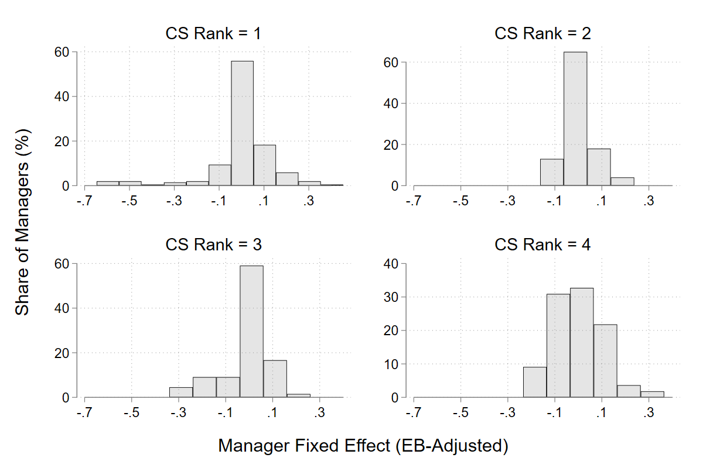
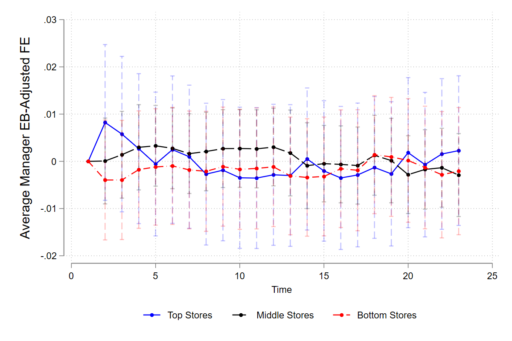
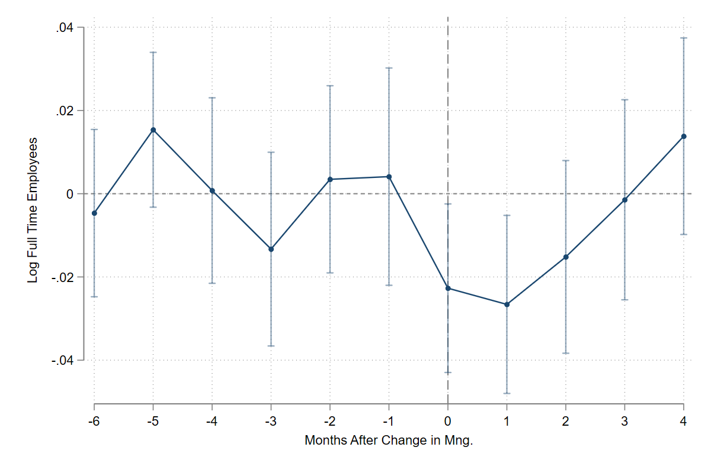

# Paper Identification

|  |   |
| ---  |  -------|
| ID  |   |
| Author  |   |
| Title  |   |
| Iteration |   |

Some useful information up front:

- [JPE Data and Code Availability Policy](https://www.journals.uchicago.edu/journals/jpe/datapolicy)
- [Step by step guidance from Data Editor for Authors](https://jpedataeditor.github.io/) 
- [Template README](https://social-science-data-editors.github.io/template_README/)


# Summary


In assessing compliance with our [Data and Code Availability Policy](https://www.journals.uchicago.edu/journals/jpe/datapolicy), our reproducibility team has identified the following issues, which we ask you to address:

1. We still find a large number of non-corresponding exhibits. Our most benign hypothesis is that you did not update some exhibits in your paper and those are out of date. Please check. Particularly worrying are the non-agreeing counts in table 2. Table 3 does not correspond as a direct consequence, I presume.
2. Table 4 is full of zeros.
3. Fig A2 is different.
4. We document plenty more differences.

# General


- [x] Data Availability and Provenance Statements
  - [x] Statement about Rights - Part 1: Right to use the data (e.g. *did the authors lawfully obtain the data*)
  - [ ] Statement about Rights - Part 2: Right to publish the data (e.g. *are human subjects involved and did permission been granted to publish their data?*)
  - [ ] License for Data (optional, but recommended)
  - [ ] Details on each Data Source
- [x] Dataset list
- [x] Computational requirements
  - [x] Software Requirements
  - [x] Controlled Randomness (as necessary)
  - [x] Memory
  - [x] Runtime
  - [ ] and Storage Requirements
- [x] Description of programs/code
  - [ ] License for Code (Optional, but recommended) 
- [ ] {REPLICATOR} to Replicators
  - [ ] Details (as necessary)
- [ ] List of tables and programs
- [ ] References (Optional, but recommended) 


# High-level Description of Research Project


*This research project...*

- [ ] uses observational data.
- [x] uses *confidential* observational data.
- [ ] uses data generated via experiment or trial by the authors (in field or lab).
  - [ ] For lab experiments: The code to implement the experimental protocol (z-Tree, o-Tree etc) is included in the package.
  - [ ] A PDF copy of IRB approval is contained in the package.
  - [ ] A PDF document outlining the design of the experiment, including information on the selection and eligibility of participants is included.
  - [ ] A PDF copy of the instructions given to participants in both original language and an English translation is included.
- [ ] uses data generated via survey by the authors (in field or online)
  - [ ] The programs used to administer the survey (e.g. qualtrics survey file) are included.
  - [ ] A PDF copy of IRB approval is contained in the package.
  - [ ] A PDF of the original questionaire(s) and information on the selection and eligibility of participants is included.
- [x] is a simulation study: the data are generated by an algorithm. (Parts of it.)
- [ ] is a numerical illustration: no data are used but code is used to produce illustrative output (tables, figures)


# Data description

The data was provided to the authors under the condition that the companies the data stems from remain anonymous. The data was provided for replication purposes but data sources, references and access conditions were not provided for this reason. 

The authors specified that the data "should be preserved in the restricted-access location of the Journal of Political Economy for as long as necessary for the successful replication of the paper. It should be deleted after the replication is confirmed. The authors commit to preserving the data and code for a period of at least five years following the publication of the paper and to provide reasonable assistance to requests for clarification and replication."

For any data that cannot be provided as part of the replication package, please provide the following information as part of the README: 

- The authors provided a codebook for the data describing the variables contained in the datasets.


## Data Sources


| file/name            | public | private | DOI/URL | Access described| cited readme | cited paper |
| ----                 | ---    | ---     | ---     | ---             | ----         | ----        | 
| data/A_dataset.dta | no    | yes      | no     | no              | no          | no         |
| data/B_dataset.dta         | no    | yes      | no       | no              | no           | no         |

### Data 


Data are not cited, no access description provided either, no information regarding the data is provided. 

- [ ] Dataset is provided in public deposit
- [x] Dataset is PRIVATELY provided (not for publication)
- [ ] DOI or URL is provided, and works: http://data.bls.gov/cgi-bin/surveymost?sm+08
- [ ] Access conditions are described:
  - No information on access conditions.
- [ ] Data are not cited, but a working paper, article, or other document is cited (not a data citation)
- [ ] Data are cited
  - [ ] in the manuscript
  - [ ] in the README:


# Requirements 


- [x] README is in TXT, MD, or PDF format
- [x] README is accessible at the root of the package (not inside a folder)
- [ ] Title conforms to guidance (starts with "Data and Code for: Title of Paper" or "Code for: Title of Paper", is properly capitalized)
- [x] Authors (with affiliations) are listed in the same order as on the paper


> {REQUIRED} Please review the title of the deposit as per our guidelines.


## Stated Requirements


- [ ] No requirements specified
- [x] Software Requirements specified as follows:
  - R (version 4.4.0) 
  - Stata (version 19)
  - Python (version 3.11.11) 
- [x] Computational Requirements specified as follows:
  - R: packages: haven, rstudioapi, doBy, lfe, Matrix 
  - Stata: packages to be installed: reghdfe, ftools, did_imputation, event_plot, binscatter, grc1leg2, schemepack
  - Python: libraries:numpy, pandas, scipy, matplotlib, os
  - ebayes.ado and fese_fast.ado (provided in repository)
- [x] Time Requirements specified as follows:
  - ca. 2h

- [ ] Requirements are complete.


For missing requirements, see the list of required changes in @sec-findings


# Analyzing Data and Code Files













## Code description


- Folder A contains 2 R scripts, a master Stata do-file which references to 5 seperate stata files. Additionally it contains 2 python files and another separate stata do-file for the simulation part of the study. Folder B replicates the same structure of folder A for the analysis for company B instead of company A, excluding the simulation. 
 



- [X] The replication package contains a "main" or "master" file(s) which calls all other auxiliary programs.

## Computing Environment of the Replicator

- MacBook Pro 24Go RAM M4Pro 
- R 4.5.1
- Stata/MP 19
- Positron with Python 3.14 

Replication time : ~33 mn (25mn for R/7mn for Stata/<1mn for Python)

and

Nuvolos 4 CPU threads and 16Go RAM
- R 4.4.1
- Stata/MP 18
- VSCode

Replication time : 1h05 (51 mn for R/15 mn for Stata/<1mn for Python)

# Replication

- Downloaded code and data from dropbox.
- Commited code to git repo.
- Installed all R packages mentioned in the ReadMe.
- Installed all Stata packages mentioned in the ReadMe. 
- Imported all Python libraries as per ReadMe. As running Python directly from Stata leads to break and procedure to put Python and Stata on the same path can be cumbersome, I propose the following manipulations. First, open the Python scripts in VSCode/RStudio/Positron. Second create a venv (`python3 -m venv .venv`) and activate it. After that you can download the packages with command (`pip install -r requirements.txt`). Also, get rid of `os`in the requirements as it is a built-in package of Python.

- Running R scripts on MacBookPro and Nuvolos : ok.

- Running Stata scripts on MacBookPro and Nuvolos : ok.

- Running Python scripts on MacbookPro and Nuvolos without issue : run without issue but we need to change the path system in `simulate_selection.py` (see below):

```Python
#%% Set directory

script_dir = os.getcwd()
# parent_dir = os.path.dirname(os.path.dirname(script_dir))
figures_dir = os.path.join(script_dir, "Results/Figures")
```
We commented `parent_dir` and replaced it by `script_dir` in `figures_dir`. Otherwise the path wrongly located at the root of the folder (`JPE-SOLLACI-20240098`).

# Findings {#sec-findings}

It seems that table 1 is not outputed directly but must be written inline in the latex file. I generated a code outputing the table `create_table_1_clean_from_fe.R`. Same issue for table 2, I did not produce compiling code.

## Missing Requirements


- [ ] Software Requirements 
  - [x] Stata
    - package: require (was missing from the required packages list)
  - [X] R
  - [ ] Python
    - [ ] Packages Version (missing)
- [X] Computational Requirements specified as follows:
  - Lenovo Thinkpad T14s, AMD Rizen AI 7 PRO with Radeon 860M, 32Go of RAM
- [X] Time Requirements 
  - ~1 hour for complete reproduction

> [REQUIRED] Please amend README to contain complete requirements. 

You can copy the section above, amended if necessary.

## Data Preparation Code

`A_estimate_fe.R` prepares the following datasets: `A_connected.dta`, `A_manager_fe.dta`, `A_store_fe.dta`. 

`A_estimate_gfe.R` prepares the following datasets: `A_manager_gid.dta`, `A_manager_gfe.dta`, `A_store_gid.dta`, `A_store_gfe.dta`.   

`A_fixed_effects.do` prepares `A_dataset_fe_eb.dta`.

`A_grouped_fixed_effects.do` prepares `A_dataset_gfe.dta`. 

`A_event_study.do` prepares `A_event_study.dta`.

`B_estimate_fe.R` prepares the following datasets: `B_connected.dta`, `B_manager_fe.dta`, `B_store_fe.dta`. 

`B_estimate_gfe.R` prepares the following datasets: `B_manager_gid.dta`, `B_manager_gfe.dta`, `B_store_gid.dta`, `B_store_gfe.dta`.   

`B_fixed_effects.do` prepares `B_dataset_fe_eb.dta`.

`B_grouped_fixed_effects.do` prepares `B_dataset_gfe.dta`. 

`B_event_study.do` prepares `B_event_study.dta`.

`selection_based_NAM.do` prepares `simulate_match.dta`. 

## Tables and Figures


- Table 1: Results slightly diverge : we only 132 obs for A 4 instead of 142 and the cov/var ratio is different for compagny B



- Table 2: The numbers reproduced do not match the table in the manuscript. See screenshots below: 

::: {#fig-three layout-ncol=3}






:::

- Figure 2: looks the same. 

- Figure 3: There are 4 figures that are called figure 3a, figure 3b, etc. It's not clear to the replicator which figure corresponds to which. For instance, the authors might consider creating a table in the ReadMe which maps the outputs to the corresponding figures. This would greatly reduce the time burden for the replicator. 

- Figure 4: Looks the same.  

- Figure 5: looks the same

- Figure 6: looks the same. 

- Figure 7: looks the same.

- Table 3: Numbers diverge similar as table 2.

::: {#fig-four layout-ncol="3"}





:::

- Figure 8: looks the same.

- Figure 9: looks the same.

- Table 4 results return 0 for each estimation. Probably a mistake.

- Figure A1 looks the same.

- Figure A2 is showing discrepancies:

::: {#fig-seven layout-ncol="2"}



:::

::: {#fig-six layout-ncol="2"}



:::

- Figure A3 showcases similar discrepancies as figure A2. 

- Figure A4 looks the same.

- Figure A5: Looks the same. 

- Table B.1 does not procuded the paper version of the table.

- Table B.2 does not procuded the paper version of the table.

- Table C.1 looks the same.

- Figure C.1 looks the same. 

- Figure C.2 looks the same. 

- Figure C.3 looks the same. 

- Table D1 are similar.

- Figure D1 displays discrepancies for both companies: 

::: {#fig-seven layout-ncol="2"}



:::

- Figure D2 looks the same. 

- Figure D3 showcases some discrepancies, but the figures are based on a randomised simulation, which could explain reasonably minor differences: 

- Figure E1: looks the same. 

- Figure E2: looks the same. 

- Figure E3 look the same.

- Table F.1 shows discrepencies :

:::{#fig-eight layout-ncol="3"}


:::

- Figure G.1: looks the same. 

- Figure G.2: looks the same. 

- Figure G.3: discrepancy in (c) full-time employment.

::: {#fig-nine layout-ncol="2"}



:::

- Figure G.4: looks the same. 

- Figure G.5: looks the same. 

- Figure G.6: looks the same. 


## In-Text Numbers

> {REPLICATOR}: list page and line number of in-text numbers. If ambiguous, cite the surrounding text, i.e., "the rate fell to 52% of all jobs: verified".

- p. 11 "Our data contains about 890 connected sets in Company A and just over 1,200 connected sets for Company B": verified

- p. 11 "The four largest connected sets in Company A have between 13 and 18 managers and 7 to 10 stores.": verified

- p. 12 "Company B. The largest set has 202 managers": verified "and 130 stores.": NOT verified, the replication excerise returns 131 stores. 

- p.12 "Set sizes to [this reads like a typo?] drop quickly, however, with the next 3 largest connected sets respectively containing 100, 66, and 55 managers and 67, 44, and 32 stores.": verified.  

- p.52 "In Company A the correlation between store fixed effects under the two methods is 0.98, and the correlation between manager fixed effects is 0.76. In Company B, these correlations are 0.93 and 0.80, respectively": Not verified. Did not see those numbers in the referenced code from the ReadMe. 

- p. 72 "Averaging these ratios, we find that the mean of r90m stands at about 0.005, with a standard deviation of 0.112. Increasing the percentile to 99 changes the average ratio r99m to about 0.021, with a standard deviation of 0.568.": verified, but the code that displays these numbers is referenced wrongly as Appenix C.2 and not E.2. 

- p. 31 "In Company A the tenure gap is 14 months and significantly different from zero at the 1% level. The gap is smaller in Company B, only 3.4 months and not statistically significant at the usual levels.": verified. 

- p. 8 "60% change managers only once, 30% change managers twice, and the remainder more frequently than that. Similarly, 14 or 23% of managers (depending on the company) work in two different stores, and a small fraction move through three or more. Between 20 and 30% of each company’s manager changes are internal": not verified, didn't find the numbers under the heading in the code indicated in the ReadMe. 

- p. 73 "almost USD 700,000 each month": not verified, I found over 700 000 USD not under."

- p.73 "about GBP 4 million": verified. 

- p.10 footnote 7 "Female managers are about 7% less likely to move to another store than male managers, a gap that cannot be explained by manager tenure or store characteristics": verified. 

## Other Issues

- Title of the Readme needs to be adjusted. 

- Line of code where results are reproduced in the codes are not provided in the ReadMe. 

- There is no clear mapping of tables/figures in the manuscripts to the tables and figure names in the results folder. Many tables and results are not saved in the results folder which makes the replication time consuming. The lines of codes were tables and figures are reproduced need to be checked in the code files. 

- There is no systemic output of tables as they are shown in the paper.

# Classification

- [ ] full reproduction
- [x] full reproduction with minor issues
- [ ] partial reproduction (see above)
- [ ] not able to reproduce most or all of the results (reasons see above)

## Reason for incomplete reproducibility

- [ ] None.
- [x] `Discrepancy in output` (either figures or numbers in tables or text differ)
- [ ] `Bugs in code` that were fixable by the replicator (but should be fixed in the final deposit)
- [ ] `Code missing`, in particular if it prevented the replicator from completing the reproducibility check
  - [ ] `Data preparation code missing` should be checked if the code missing seems to be data preparation code
- [ ] `Code not functional` is more severe than a simple bug: it prevented the replicator from completing the reproducibility check
- [ ] `Software not available to replicator` may happen for a variety of reasons, but in particular (a) when the software is commercial, and the replicator does not have access to a licensed copy, or (b) the software is open-source, but a specific version required to conduct the reproducibility check is not available.
- [ ] `Insufficient time available to replicator` is applicable when (a) running the code would take weeks or more (b) running the code might take less time if sufficient compute resources were to be brought to bear, but no such resources can be accessed in a timely fashion (c) the replication package is very complex, and following all (manual and scripted) steps would take too long.
- [ ] `Data missing` is marked when data *should* be available, but was erroneously not provided, or is not accessible via the procedures described in the replication package
- [ ] `Data not available` is marked when data requires additional access steps, for instance purchase or application procedure. 
- [ ] `Missing README` is marked if there is no README to guide the replicator, or the README is not in compliance with JPE requirements


